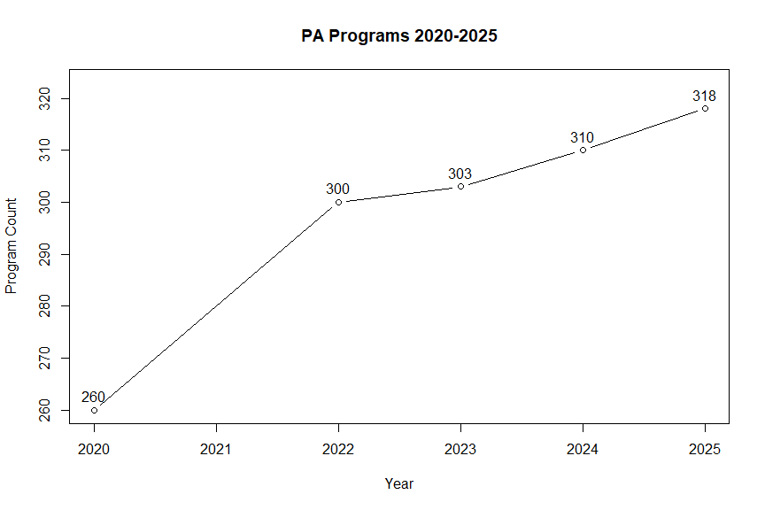
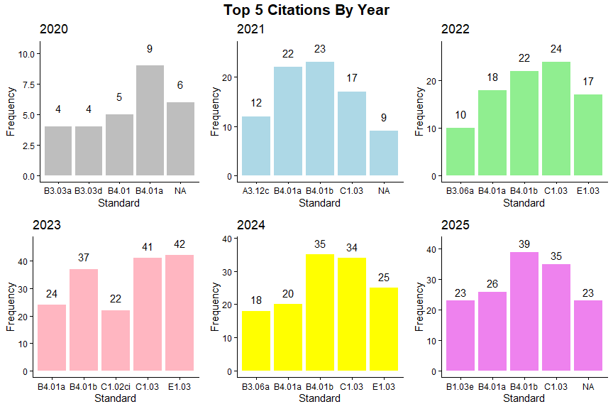
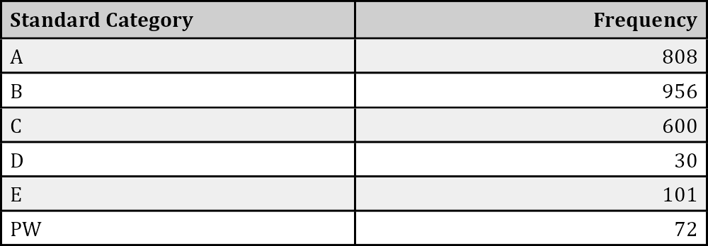

Report on the ARC-PA 5th Edition Standards Accreditation Actions
================
Andrew Stakem
2026-02-04

The Accreditation Review Commission on Education for the Physician
Assistant (ARC-PA), holds commissioner’s meetings three times each year
to review PA programs and discuss the accreditation actions to be taken
by the commission toward each program. The actions taken are published
by the commission after each meeting. The following is an analysis of
the actions taken during the era of the 5th edition standards.June
2020-September 2025.

## By The Numbers

1.  Total Number of PA Programs 2020/2025
2.  Programs Reviewed
3.  Actions Taken

------------------------------------------------------------------------

### **1.**

The growth of PA programs in the Unites States since June of 2020 has
been considerable. As of August 2025, 58 new programs are in operation,
a 22.3% increase. A large proportion of those new programs came into
operation between 2020 and 2022 with the growth tapering off in more
recent years. But even though the growth has slowed, new programs
continue to open at colleges and universities across the country.

\*2021 data for program growth was not available at the time of this
report

------------------------------------------------------------------------

### **2.**

The total number of programs reviewed by the ARC-PA Between June 2020
and June 2025 is **355**. This number includes all programs who
underwent review, this includes programs who received no citations.
Programs who underwent multiple review cycles during this period are
counted once for each cycle that was undertaken. Two review cycles = two
counts of programmatic review.

------------------------------------------------------------------------

### **3.**

The total number of citations given by the ARC-PA between June, 2020 and
September, 2025 is **2567**. This number is comprehensive of all
citations that were given and does not include actions taken such as
awarding changes in accreditation status or programs that were under
review and did not receive any citations.

------------------------------------------------------------------------

## 4. Analysis of the Citations

The citations administered by the ARC-PA are divided into six categories
according to the ARC-PA 5th Edition Standards. These categories include
A standards, B, C, D, E, and Portal related Standards. The following
information details the most common citations administered overall by
the ARC-PA, the top citations from year to year, and the total number of
citations given for each category of standard.

------------------------------------------------------------------------

**Top 10 Citations**

<table class="table table-striped table-bordered table-hover" style="width: auto !important; margin-left: auto; margin-right: auto;">

<caption>

Top 10 Most Common Citations Jun20-Sept25
</caption>

<thead>

<tr>

<th style="text-align:left;">

Standard
</th>

<th style="text-align:center;">

n
</th>

<th style="text-align:left;">

Standard Text
</th>

</tr>

</thead>

<tbody>

<tr>

<td style="text-align:left;">

B4.01b
</td>

<td style="text-align:center;">

158
</td>

<td style="text-align:left;">

The program must conduct frequent, objective and documented evaluations
of student performance in meeting the program’s learning outcomes and
instructional objectives for both didactic and supervised clinical
practice experience components. The evaluations must: b) allow the
program to identify and address any student deficiencies in a timely
manner
</td>

</tr>

<tr>

<td style="text-align:left;">

C1.03
</td>

<td style="text-align:center;">

154
</td>

<td style="text-align:left;">

The program must prepare a self-study report as part of the application
for accreditation that accurately and succinctly documents the process,
application and results of ongoing program self assessment. The report
must follow the guidelines provided by the ARC-PA
</td>

</tr>

<tr>

<td style="text-align:left;">

B4.01a
</td>

<td style="text-align:center;">

119
</td>

<td style="text-align:left;">

The program must conduct frequent, objective and documented evaluations
of student performance in meeting the program’s learning outcomes and
instructional objectives for both didactic and supervised clinical
practice experience components. The evaluations must: a) align with what
is expected and taught
</td>

</tr>

<tr>

<td style="text-align:left;">

E1.03
</td>

<td style="text-align:center;">

92
</td>

<td style="text-align:left;">

The program must submit reports or documents as required by the ARC-PA
</td>

</tr>

<tr>

<td style="text-align:left;">

B3.06a
</td>

<td style="text-align:center;">

79
</td>

<td style="text-align:left;">

Supervised clinical practice experiences should occur with: a)
physicians who are specialty board certified in their area of
instruction
</td>

</tr>

<tr>

<td style="text-align:left;">

C1.02b
</td>

<td style="text-align:center;">

60
</td>

<td style="text-align:left;">

The program must implement its ongoing self-assessment process by: b)
performing critical analysis of data
</td>

</tr>

<tr>

<td style="text-align:left;">

C1.02ci
</td>

<td style="text-align:center;">

57
</td>

<td style="text-align:left;">

The program must implement its ongoing self-assessment process by: c)
applying the results leading to conclusions that identify: i. program
strengths
</td>

</tr>

<tr>

<td style="text-align:left;">

C1.02cii
</td>

<td style="text-align:center;">

53
</td>

<td style="text-align:left;">

The program must implement its ongoing self-assessment process by: c)
applying the results leading to conclusions that identify: ii. program
areas in need of improvement
</td>

</tr>

<tr>

<td style="text-align:left;">

C1.02ciii
</td>

<td style="text-align:center;">

52
</td>

<td style="text-align:left;">

The program must implement its ongoing self-assessment process by: c)
applying the results leading to conclusions that identify: iii. action
plans
</td>

</tr>

<tr>

<td style="text-align:left;">

B1.03e
</td>

<td style="text-align:center;">

50
</td>

<td style="text-align:left;">

For each didactic and clinical course (including required and elective
rotations), the program must define and publish learning outcomes and
instructional objectives, in measurable terms that can be assessed and
that guide student acquisition of required competencies
</td>

</tr>

</tbody>

</table>

------------------------------------------------------------------------

**Top 5 Citations By Year** The grid below represents the top 5
standards that were cited by the ARC-PA in the given calendar year.
Representing some of the change over time in priorities and programmatic
needs.

------------------------------------------------------------------------

**Citation Count By Category** The data below represents the total
number of citations made for each category of standard, A standards, B
Standards, C, D, E, and PW (Program Portal/Website related standards).

------------------------------------------------------------------------

## Addendum: Maryland Specific Citation Analysis

Beginning in June 2020 through the present there have been 89 citations
levied against the six programs within the state of Maryland. These
citations are found across the spectrum of standards from the ARC-PA’s
5th edition. Most notably, the B standards are cited in the top 6 most
common citations 3 times. (Top 6 was selected due to a drop in citation
count after the 6th observation).

<table class="table table-striped table-bordered" style="width: auto !important; ">

<caption>

Maryland Top 6 Most Common Citations Jun20-Sep25
</caption>

<thead>

<tr>

<th style="text-align:left;">

Standard
</th>

<th style="text-align:center;">

n
</th>

<th style="text-align:left;">

Standard Text
</th>

</tr>

</thead>

<tbody>

<tr>

<td style="text-align:left;">

B4.01a
</td>

<td style="text-align:center;">

5
</td>

<td style="text-align:left;">

The program must conduct frequent, objective and documented evaluations
of student performance in meeting the program’s learning outcomes and
instructional objectives for both didactic and supervised clinical
practice experience components. The evaluations must: a) align with what
is expected and taught
</td>

</tr>

<tr>

<td style="text-align:left;">

B4.01b
</td>

<td style="text-align:center;">

5
</td>

<td style="text-align:left;">

The program must conduct frequent, objective and documented evaluations
of student performance in meeting the program’s learning outcomes and
instructional objectives for both didactic and supervised clinical
practice experience components. The evaluations must: b) allow the
program to identify and address any student deficiencies in a timely
manner
</td>

</tr>

<tr>

<td style="text-align:left;">

E1.03
</td>

<td style="text-align:center;">

4
</td>

<td style="text-align:left;">

The program must submit reports or documents as required by the ARC-PA
</td>

</tr>

<tr>

<td style="text-align:left;">

A3.12b
</td>

<td style="text-align:center;">

3
</td>

<td style="text-align:left;">

The program must define, publish, consistently apply and make readily
available to enrolled and prospective students, policies and procedures
to include: b) evidence of its effectiveness in meeting its goals
</td>

</tr>

<tr>

<td style="text-align:left;">

A3.13a
</td>

<td style="text-align:center;">

3
</td>

<td style="text-align:left;">

The program must define, publish, consistently apply and make readily
available to prospective students, policies and procedures to include:
a) admission and enrollments practices that favor specified individuals
or groups (if applicable)
</td>

</tr>

<tr>

<td style="text-align:left;">

B1.03e
</td>

<td style="text-align:center;">

3
</td>

<td style="text-align:left;">

For each didactic and clinical course (including required and elective
rotations), the program must define and publish for students the
following detailed information in syllabi or appendix to the syllabi: e)
learning outcomes and instructional objectives, in measurable terms that
can be assessed, that guide student acquisition of required competencies
</td>

</tr>

</tbody>

</table>

------------------------------------------------------------------------

The citations above tell a story of struggles with student success and
learning outcomes along with procedural report or documentation related
citations. With a limited number of programs in the state being reviewed
at different stages of the accreditation cycle, the number of citations
and overall makeup of the standards that are cited can be skewed by one
program during an unfavorable review process. The standards that are
cited most (5 or 4 citations) can point to larger issues within the
Maryland PA educational community that need to be addressed as these
standards are given as citations to multiple programs in the state and
in some cases, the same program multiple times.

## Bibliography

1.  Accreditation Review Commission on Education for the Physician
    Assistant. (2019). Accreditation Standards for Physician Assistant
    Education. 5th Edition. Retrieved from
    <http://www.arc-pa.org/wp-content/uploads/2019/11/Standards-5th-Ed-Nov-2019.pdf>
2.  Accreditation Review Commission on Education for the Physician
    Assistant. (2020). “NOTICE OF ACTIONS – ACCREDITATION STATUS
    (9.2.2020)”.
    <https://www.arc-pa.org/wp-content/uploads/2025/05/Accreditation-Actions-2020Ju-9.2.pdf>.
    Accessed on: 08/27/2025.
3.  Accreditation Review Commission on Education for the Physician
    Assistant. (2020). “NOTICE OF ACTIONS – ACCREDITATION STATUS
    (1.4.2021)”.
    <https://www.arc-pa.org/wp-content/uploads/2025/05/Accreditation-Actions-2020S.pdf>.
    Accessed on: 08/27/2025.
4.  Accreditation Review Commission on Education for the Physician
    Assistant. (2021). “NOTICE OF ACTIONS – ACCREDITATION STATUS
    (8.2.2021)”.
    <https://www.arc-pa.org/wp-content/uploads/2025/05/Accreditation-Actions-2021M-8.2.pdf>.
    Accessed on: 08/27/2025.
5.  Accreditation Review Commission on Education for the Physician
    Assistant. (2021). “NOTICE OF ACTIONS – ACCREDITATION STATUS
    (7.26.2021)”.
    <https://www.arc-pa.org/wp-content/uploads/2025/05/Accreditation-Actions-2021J-.pdf>.
    Accessed on: 08/27/2025.
6.  Accreditation Review Commission on Education for the Physician
    Assistant. (2021). “NOTICE OF ACTIONS – ACCREDITATION STATUS
    (12.8.2021)”.
    <https://www.arc-pa.org/wp-content/uploads/2025/05/Accreditation-Actions-2021S.pdf>.
    Accessed on: 08/27/2025.
7.  Accreditation Review Commission on Education for the Physician
    Assistant. (2022). “NOTICE OF ACTIONS – ACCREDITATION STATUS
    (8.8.2022)”.
    <https://www.arc-pa.org/wp-content/uploads/2025/05/Accreditation-Actions-2022M.pdf>.
    Accessed on: 08/27/2025.
8.  Accreditation Review Commission on Education for the Physician
    Assistant. (2022). “NOTICE OF ACTIONS – ACCREDITATION STATUS
    (9.9.2022)”.
    <https://www.arc-pa.org/wp-content/uploads/2025/05/Accreditation-Actions-2022J-9.12.22.pdf>.
    Accessed on: 08/27/2025.
9.  Accreditation Review Commission on Education for the Physician
    Assistant. (2022). “NOTICE OF ACTIONS – ACCREDITATION STATUS
    (3.29.2023)”.
    <https://www.arc-pa.org/wp-content/uploads/2025/05/Accreditation-Actions-2022S.pdf>.
    Accessed on: 08/27/2025.
10. Accreditation Review Commission on Education for the Physician
    Assistant. (2023). “NOTICE OF ACTIONS – ACCREDITATION STATUS
    (7.17.2023)”.
    <https://www.arc-pa.org/wp-content/uploads/2025/05/Accreditation-Actions-2023M-all-programs1.2.24.pdf>.
    Accessed on: 08/27/2025.
11. Accreditation Review Commission on Education for the Physician
    Assistant. (2023). “NOTICE OF ACTIONS – ACCREDITATION STATUS
    (8.8.2023)”.
    <https://www.arc-pa.org/wp-content/uploads/2025/05/Accreditation-Actions-2023J.pdf>.
    Accessed on: 08/27/2025.
12. Accreditation Review Commission on Education for the Physician
    Assistant. (2023). “NOTICE OF ACTIONS – ACCREDITATION STATUS
    (8.8.2023)”.
    <https://www.arc-pa.org/wp-content/uploads/2025/05/Accreditation-Actions-2023S-excl-appeals.pdf>.
    Accessed on: 08/27/2025.
13. Accreditation Review Commission on Education for the Physician
    Assistant. (2024). “NOTICE OF ACTIONS – ACCREDITATION STATUS
    (7.18.24)”.
    <https://www.arc-pa.org/wp-content/uploads/2025/05/Accreditation-Actions-2024M-all-programs-1.pdf>.
    Accessed on: 08/27/2025.
14. Accreditation Review Commission on Education for the Physician
    Assistant. (2024). “NOTICE OF ACTIONS – ACCREDITATION STATUS
    (9.24.24)”.
    <https://www.arc-pa.org/wp-content/uploads/2025/05/Accreditation-Actions-2024J-all-programs.pdf>.
    Accessed on: 08/27/2025.
15. Accreditation Review Commission on Education for the Physician
    Assistant. (2024). “NOTICE OF ACTIONS – ACCREDITATION STATUS
    (10.4.24)”.
    <https://www.arc-pa.org/wp-content/uploads/2025/05/Accreditation-Actions-2024S-all-programs.pdf>.
    Accessed on: 08/27/2025.
16. Accreditation Review Commission on Education for the Physician
    Assistant. (2025). “NOTICE OF ACTIONS – ACCREDITATION STATUS
    (7.15.25)”.
    <https://www.arc-pa.org/wp-content/uploads/2025/07/Accreditation-Actions-2025M-final-1.pdf>.
    Accessed on: 08/27/2025.
17. Accreditation Review Commission on Education for the Physician
    Assistant. (2025). “NOTICE OF ACTIONS – ACCREDITATION STATUS
    (7.16.25)”.
    <https://www.arc-pa.org/wp-content/uploads/2025/08/Accreditation-Actions-2025J-before-recon-2.pdf>.
    Accessed on: 08/27/2025.
18. Accreditation Review Commission on Education for the Physician
    Assistant. (2025). “NOTICE OF ACTIONS – ACCREDITATION STATUS
    (1.7.26)”.
    <https://www.arc-pa.org/wp-content/uploads/2026/01/Accreditation-Actions-2025S-.Jan_.2026.pdf>.
    Accessed on: 02/04/2026.
