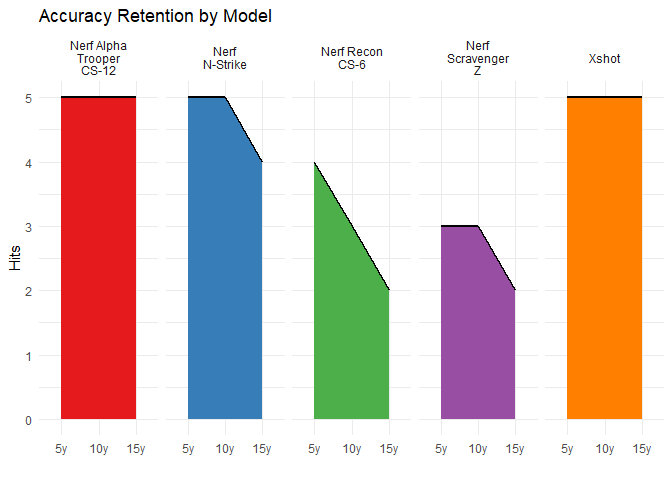
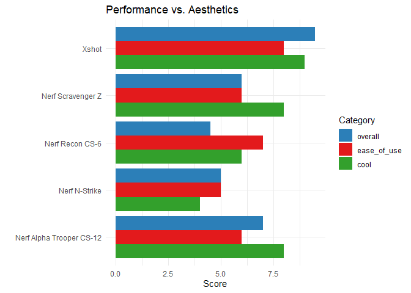
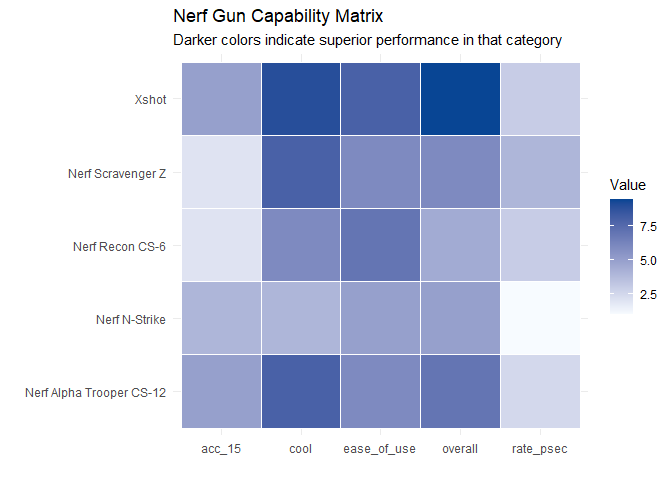

Nerf Gun Performance Analysis
================
Your Name
2026-02-12

## Introduction

The following Report is an evaluation of various attributes related to
Nerf Guns and similar market adjacent foam dart guns, all models in this
report colloquially referred to as Nerf Guns. The evaluated metrics
include accuracy, ergonomic handling, and aesthetic appeal. The goal is
to identify which models offer the best field utility versus those that
rely primarily on visual design. The gun models in this report include
the **Nerf Recon CS-6**, **Nerf Alpha Trooper CS-12**, **Xshot** (full
model name unavailable), **Nerf Scravenger Z**, and **Nerf N-Strike**.

------------------------------------------------------------------------

#### 1. Accuracy Retention by Distance

The following chart illustrates how each gun’s accuracy holds up as the
target distance increases from 5 to 15 yards.

<!-- -->

**Analysis:** The top performers were the **Nerf Alpha Trooper CS-12**
and the **Xshot** maintained their accuracy across all testing
distances. The power and consistent accuracy would be incredibly
valuable in any neighborhood battle allowing you to confidently reach
your target from beyond the range of the other guns. The worst
performers were the **Nerf Recon CS-6** and the **Nerf Scravenger Z**.
Neither gun was perfectly accurate from the shortest distance and
neither gun even maintained accuracy from that point. Any users of these
models would be at a disadvantage from a shot efficiency standpoint.

------------------------------------------------------------------------

#### Performance vs. Aesthetics

This chart compares the “Cool Factor” against “Ease of Use” and “Overall
Score” to identify which guns are over-engineered vs. which are
under-performing.

<!-- -->

**Analysis:** The above chart focuses on ease of use, cool factor (an
aesthetic metric), and the overall rating for the gun. You can see the
high performers across all metrics included the **Xshot** and **Nerf
Alpha Trooper CS-12**. Coupled with the high performance in the accuracy
retention test. These guns rated very well overall. An unexpected high
performer was the **Nerf Scravenger Z**. This gun performed incredibly
well in the cool factor metric and admirably in ease of use. This led to
a high rating despite a low performance in accuracy, which means, that
even if you lose some battles in the neighborhood due to poor
performance, the gun is comfortable and looks cool so you can still
consider this model a strong choice.

------------------------------------------------------------------------

#### Capability Matrix

The following chart represents the strengths of each gun across all
metrics in the evaluation.

<!-- -->

**Analysis:** The intensity of the matrix reveals that the **Xshot** is
the most well-rounded entry, showing high performance across every
tested category. Conversely, the **Nerf Scravenger Z** represents a
specialized trade-off: it delivers the highest rate of fire in the group
but suffers from significantly lower accuracy making it a “niche” choice
for close-quarters spray rather than precision. A good use-case for this
sort of gun would be a battle in the house where combatents will be in a
confined space.

------------------------------------------------------------------------

#### Style vs. Substance Quadrant Analysis

This comparison shows the correlation of style and substance across the
various models. What guns are cool? What guns are effective? Then what
guns are both cool and effective?

<!-- -->

Analysis: This comparison identifies the **Xshot** and **Nerf Alpha
Trooper CS-12** as elite hardware that justifies its visual appeal with
superior performance. The **Nerf Recon CS-6** occupies the most
problematic position on the grid—scoring high for aesthetics while
falling below the group average for overall functionality—marking it as
an appearance heavy model that lacks the substance of its more efficient
peers.

------------------------------------------------------------------------

| gun                      | Overall Score | Cool Factor | Rate (sec) |
|:-------------------------|--------------:|------------:|-----------:|
| Xshot                    |           9.5 |           9 |        3.0 |
| Nerf Alpha Trooper CS-12 |           7.0 |           8 |        2.5 |
| Nerf Scravenger Z        |           6.0 |           8 |        4.0 |
| Nerf N-Strike            |           5.0 |           4 |        1.0 |
| Nerf Recon CS-6          |           4.5 |           6 |        3.0 |

Nerf Gun Leaderboard: Ranked by Overall Performance

------------------------------------------------------------------------

## Final Summary & Conclusion

This evaluation demonstrates that while aesthetic appeal (the “Cool
Factor”) is a major component of the hobby, it rarely guarantees field
performance. The data reveals three distinct categories of hardware:

1.  **The Elites:** The **Xshot** and **Nerf Alpha Trooper CS-12** are
    the definitive top-tier choices. They dominate both the performance
    and aesthetic metrics, making them the most reliable primary options
    for any engagement.
2.  **The Specialists:** The **Nerf Scravenger Z** and **Nerf N-Strike**
    offer niche utility. The Scravenger provides a high rate of fire for
    close-quarters combat, while the N-Strike serves as a highly
    serviceable and accurate secondary sidearm.
3.  **The Display Models:** The **Nerf Recon CS-6** represents a “trap”
    for users; despite its strong visual design and ergonomic comfort,
    its mechanical performance and accuracy decay make it uncompetitive
    in active battles.

**Final Recommendation:** For the most balanced option, the **Xshot**
provides the best return on investment, successfully bridging the gap
between style and substance.
